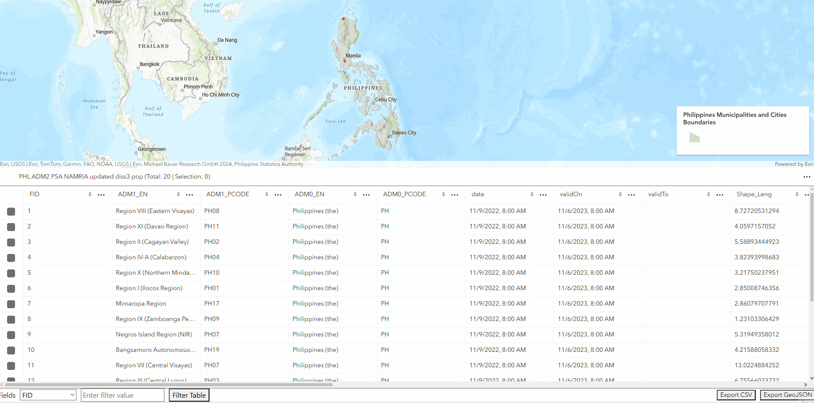
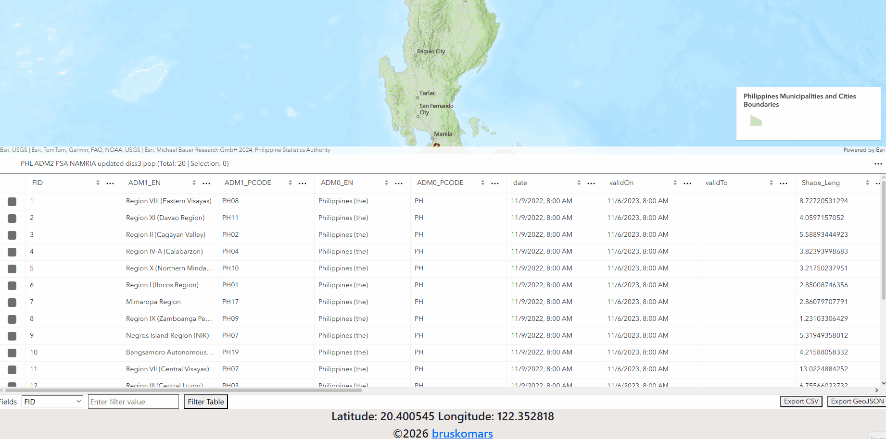
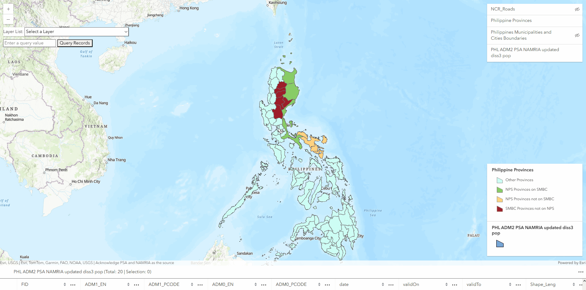

# GIS WEB APP using ARCGIS API JS

**Interactive GIS Web App with Query, Filter, and Export Tools built using ArcGIS API for JavaScript.**

****Features****

- Query records by attribute (zoom + highlight + separate layer)
- Dynamic FeatureTable switching
- Attribute filtering with dropdown + text input
- Export results to CSV/GeoJSON
- Layer list + legend integration
- Map coordinates on hover

****Demo****

**Demo of filtering and exporting**

**Demo of feature table switching**

**Demo of coordinates changing on hover**

**Demo of query records and create new layer for results and zoom to results**

**Demo of toggling of layers**

****Tech Stack****

- ArcGIS API for JavaScript
- HTML/CSS/JS
- Blob API for client‑side export

****How to Run****

- Clone repo
- Open index.html in browser
- Requires ArcGIS API key (instructions to replace with their own)
